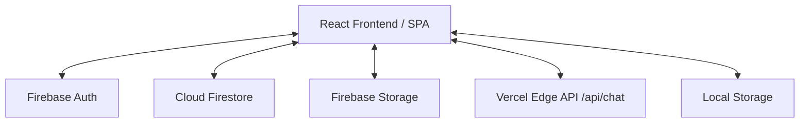

# 📊 Motazin (مُتّزِن) API & Architecture Documentation

This document provides a comprehensive overview of the architecture, data flows, security guidelines, and API specifications for the Motazin Web Application.

---

## 🏗️ 1. System Architecture Overview

Motazin is built as a modern, client-first Single Page Application (SPA) leveraging **React**, **TypeScript**, and **Tailwind CSS**, with **Firebase** as the serverless backend.



### Key Architectural Patterns
* **Command Pattern for History**: Instead of caching complete application state arrays (`Transaction[][]`) for Undo/Redo operations, which is memory-heavy ($O(N \times M)$), Motazin records only the delta actions (`HistoryAction`) in a linear stack. This reduces memory usage to $O(N + M)$ and enables instant undo/redo calculations.
* **Dual-Storage Synchronizer**: Automatically cleans up client-side `localStorage` when a user logs in, relying on Firestore as the single source of truth. When the user logs out, offline records are restored to `localStorage` to support uninterrupted offline usage.
* **Optimized Firestore Sync**: A custom diff-based updater compares the local state with Firestore, initiating batch writes only for modified, added, or deleted transactions, rather than writing the entire database on every change.

---

## 🗄️ 2. Database Schema & Storage

### 2.1 Firestore Collections

#### Collection: `/users`
Stores user settings and configurations.
```json
{
  "theme": "dark" | "light" | "system",
  "language": "ar" | "en" | "fr" | "es" | "tr" | "ur",
  "currency": "OMR" | "USD" | "SAR" | "AED" | "KWD" | "BHD" | "QAR" | "EGP",
  "updatedAt": "ISO-8601 Timestamp"
}
```

#### Collection: `/users/{userId}/transactions`
Stores double-entry transaction documents.
```json
{
  "date": "DD/MM/YYYY" | "YYYY-MM-DD",
  "description": "String",
  "createdAt": "ISO-8601 Timestamp",
  "recurrenceInterval": "daily" | "weekly" | "monthly" | "yearly" | null,
  "nextRecurrenceDate": "ISO-8601 Timestamp" | null,
  "impacts": [
    {
      "accountId": "String",
      "amount": "Number"
    }
  ]
}
```

### 2.2 Cloud Firestore Security Rules (`firestore.rules`)
```javascript
rules_version = '2';
service cloud.firestore {
  match /databases/{database}/documents {
    // Helper to check ownership
    function isOwner(userId) {
      return request.auth != null && request.auth.uid == userId;
    }
    
    match /users/{userId} {
      allow read, write: if isOwner(userId);
      
      match /transactions/{txId} {
        allow read, write: if isOwner(userId);
      }
    }
  }
}
```

---

## 🤖 3. AI Chatbot API (`/api/chat.ts`)

Motazin integrates with Gemini AI through a serverless backend proxy endpoint.

### Endpoint Specification
* **Path**: `/api/chat`
* **Method**: `POST`
* **Content-Type**: `application/json`

#### Request Payload
```json
{
  "message": "String (User query)",
  "history": [
    { "role": "user" | "model", "parts": [{ "text": "String" }] }
  ],
  "context": {
    "totalAssets": 15000.0,
    "totalLiabilities": 5000.0,
    "totalEquity": 10000.0,
    "netProfit": 2500.0,
    "currentRatio": 3.0,
    "isBalanced": true,
    "transactionCount": 12
  },
  "geminiApiKey": "String (Optional override key from localStorage)"
}
```

#### Response Payload (Success)
```json
{
  "reply": "String (Markdown text response from Gemini)"
}
```

#### Response Payload (Error / Rate Limit 429)
```json
{
  "error": "Quota exceeded",
  "status": 429
}
```

---

## 📴 4. PWA & Offline Support

The Progressive Web App (PWA) configuration is powered by `vite-plugin-pwa` using Workbox:
* **Service Worker**: Generates a standard `sw.js` that precaches static assets (HTML, CSS, JS, Fonts).
* **Caching Strategy**: `StaleWhileRevalidate` is applied to static files, ensuring near-instantaneous load times while downloading updates in the background.
* **Offline Fallbacks**: Automatically falls back to local mock keywords for AI Chat replies when internet connectivity is lost.

---

## 🔒 5. Security & CSP Guidelines

To protect the financial calculations and user inputs, the web server/headers mandate the following Content-Security-Policy (CSP):

```text
default-src 'self';
script-src 'self';
style-src 'self' https://fonts.googleapis.com;
font-src 'self' https://fonts.gstatic.com;
img-src 'self' data: https://lh3.googleusercontent.com;
connect-src 'self' https://*.googleapis.com https://identitytoolkit.googleapis.com;
frame-src 'self';
```
*(Note: 'unsafe-inline' and 'unsafe-eval' are strictly disabled to prevent XSS exploits).*
